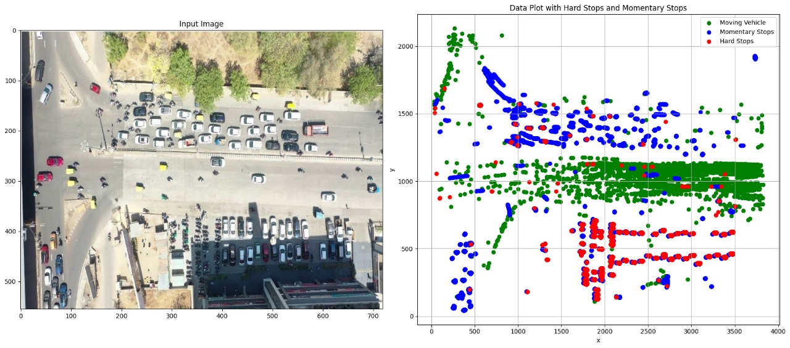

# Hard Stop & Momentary Stop Detection In Vehicles 

 

# Overview:

This repository contains the code and reports for the project titled "Hard Stop & Momentary Stop Detection In Vehicles." The project aims to analyze vehicle trajectories at signalized junctions and distinguish between different stop conditions such as "Momentary" and "Hard" stops, along with identifying continuous moving vehicles.

 

# Folder Structure:
 

*code*: Contains all the code files related to data preprocessing, feature extraction, model training, evaluation, and visualization.

*dataset*: Contains the dataset used for analysis (single.csv).

*nd-reports*: Contains the final reports summarizing the project methodology, results, and conclusions.

*mid-reports*: Contains the mid-term reports detailing the progress and findings during the midway phase of the project.

*weekly-reports*: Contains weekly progress reports documenting the team's activities, challenges, and goals.

*presentations*: Contains presentation slides used for project meetings, reviews, and presentations.

*results*: Contains visualizations, graphs, and other result outputs generated during the analysis.

 

# Code:
The code directory contains Python scripts used for data preprocessing, feature engineering, model training, evaluation, and visualization.

 

# Results:
The results directory contains visualizations, graphs, and other output files generated during the analysis. These include scatter plots, confusion matrices, and image comparisons to illustrate the model's performance and insights gained from the data.

  <!-- Add this line to include the image -->

 

# Conclusion:

This repository serves as a comprehensive resource for understanding the project methodology, findings, and outcomes related to the detection of hard stops, momentary stops, and moving vehicles in vehicle trajectories. The code, reports, and results provide valuable insights into traffic dynamics and stop patterns at signalized junctions, contributing to traffic management and urban development initiatives.

 

# Contributors: 

[*Parth Joshi*](https://github.com/Parth0404)
 
[*Krutarth Vora*](https://github.com/ksv1112) 
 
[*Harsh Choksi*](https://github.com/hhchoksi)
 
[*Niyati Patel*](https://github.com/Niyati44)
 

 

# Note: 
 

The dataset used in this project has been removed from the repository due to privacy concerns. The dataset was provided by the university and contains sensitive information. We respect the privacy and confidentiality of the data provided by the university and have therefore removed it from the repository. 
